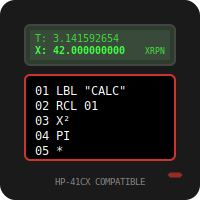

# XRPN

 [](https://badge.fury.io/rb/xrpn)  

 XRPN is a stack-based programming language, similar to [Forth](https://en.wikipedia.org/wiki/Forth_(programming_language)), but simpler in nature.
 
XRPN is on-the-fly extensible. Language functions can be upgraded or implemented while programs are running.

It runs programs in text files or manually in debug mode (if no text file is supplied or when a program stops). 

The language is a superset of [FOCAL](https://www.hpmuseum.org/prog/hp41prog.htm), implementing the full set of [HP-41CX calculator](https://www.hpmuseum.org/hp41.htm) commands. It uses Reverse Polish Notation for calculations.

XRPN implements indirect addressing, self-modification and features well beyond the FOCAL language.

## Install

You need Ruby installed to get XRPN to work.

To install XRPN, you can do `gem install 'xrpn'` or by cloning this repository and run the script `INSTALL.sh`.  It is only tested on Linux but should work well on Mac OS and BSD systems. If you are on Windows, please tell me if it works in that environment. The install script will put create a symbolic link in your home directory - named ".xrpn" to make it a hidden directory - pointing to the cloned repo. It will also attempt to add a symlink to "~/bin" to make it easy to run XRPN. If you install XRPN by cloning this repo, you also need to install the Ruby Gem tty-prompt: `gem install tty-prompt`. If you install via `gem install 'xrpn'`, then this dependency is automatically taken care of. The gem is slower on startup than running XRPN from this repo. Also, `speaker-test` must be installed to play tones, but this is preinstalled on most Lunux/BSD systems.

## Run

To run XRPN, make sure the program file ("bin/xrpn") is copied or linked to a directory in your path. If you have "~/bin" in your path, the install scrip has already taken care of this. Simply run the environment via `xrpn` in a terminal to enter the "debug mode" and manually issue commands or do calculations. To run a program, save it in a text file (like "myprogram.txt") and run `xrpn -f myprogram.txt` or `xrpn --file myprogram.txt` to let xrpn execute it. If you want to load a program without running it immediately, you can use the `-l` or `--load` switch like this `xrpn -l myprogram.txt`. If you want to load several program files, just separate the file names with commas (and no spaces) like this `xrpn -l prgm1.txt,prgm2.txt`. You can also save a full XRPN state with the stack, registers, flags, settings and programs in various pages and load that when starting XRPN with the -s switch. You can check a program for possible errors via the -c switch: `xrpn -c myprogram.txt`.

The full synopsis goes like this:
```
Usage: xrpn [options]
    -e, --execute string             Interpret string as program and run
    -f, --file program               Specify the file to process
    -l, --load program(s)            File(s) to load, but not run
    -s, --state STATE                Load a State file
    -c, --check program              Program file to check for errors
    -x, --X X-value                  Set initial value in the X register
    -y, --Y Y-value                  Set initial value in the Y register
    -z, --Z Z-value                  Set initial value in the Z register
    -t, --T T-value                  Set initial value in the T register
    -a, --Alpha Alpha-string         Set initial string in Alpha
    -h                               Display SHORT help text
        --help                       Display LONG help text
    -v, --version                    Display the XRPN version number
```
A program can be run by supplying a program file (option -f), by supplying a string with commands separated by commas (option -e) or by starting xrpn without any options and keying in the program manually.

Using the -eoption, you could do e.g. `xrpn -e "43, sin, 1/x, prx"`.

You can also pipe a string into xrpn like this: `echo "1,2,+,4,/,prx" | xrpn`.

## FOCAL and the HP-41 system

Since XRPN covers the function set of the HP-41CX calculator, you now have an environment where thousands of HP-41 calculator programs can run. You have at your fingertips programs covering engineering, finance, chemistry and physics to navigation, astronomy, forecasting, statistics and most areas of science and mathematics. With the enhanced features, you can make self-modifying programs, capture web pages, get full regexp capabilities, manipulate files and plenty more.

With more than 250 built-in functions, there is a lot to document. The documentation is unfolding in [the wiki page in this repo](https://github.com/isene/xrpn/wiki/XRPN-Documentation).

Note that I have not yet implemented the clock, the alarm and stopwatch functionality of the HP-41CX as I can't yet see much benefit to that. The functions TIME, DATE, DATE+, DDAYS, DOW, HR, HMS, HMS+, HMS- are implemented.

## Example program

To give you a taste of XRPN, consider this program:

```
LBL "HELLO"
"Input your name. Enclose your name in double-quotes and press Enter."
PROMPT
ASTO 00
"Hello, "
ARCL 00
ADV
AVIEW
ADV
13
8
*
100
X<>Y
X>Y?
"13 * 8 is greater than 100"
AVIEW
END
```

## Changelog

### Version 2.5 (Latest)
**Critical Bug Fixes and Performance Enhancements**

- **Fixed division by zero crashes** - Now properly handles division by zero with error messages instead of crashing
- **Fixed nil reference errors in statistics** - Statistics commands (like `mean`) now handle empty or uninitialized registers gracefully
- **Fixed variable name error in file operations** - Corrected undefined variable reference in `getfile` command
- **Fixed indirect addressing nil references** - Indirect addressing now handles nil register values safely
- **Optimized file system operations** - Improved startup performance by using `FileUtils.mkdir_p` for directory creation
- **Fixed memory leak** - TTY::Prompt is now lazily initialized only when debug mode is actually used
- **Optimized numeric formatting** - Eliminated redundant string conversions in rounding overflow calculations
- **Added comprehensive test suite** - New test programs in `/tests/` directory to verify bug fixes and prevent regressions

This release significantly improves the stability and performance of XRPN while maintaining full backward compatibility.

### Version 2.4
- Fixed loading of files via the -f switch

## Documentation

...is all in [the wiki page in this repo](https://github.com/isene/xrpn/wiki/XRPN-Documentation).


## Note

Thanks to the HP Calculator community, the Astrophysical Institute in Oslo and to my lovely Siv for inspirations.

Any and all feedback is welcome. Send me an e-mail at `g@isene.com`.
